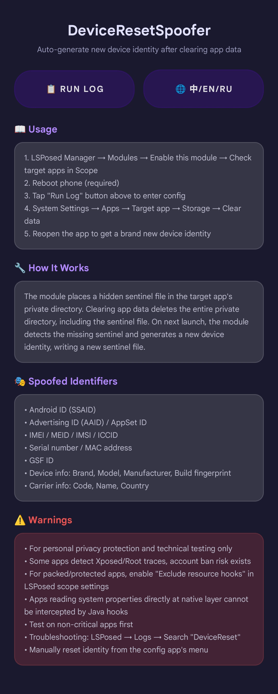
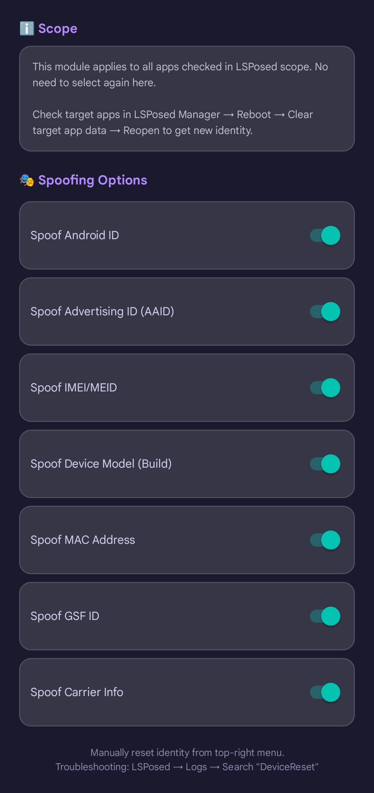

# DeviceResetSpoofer

> 清除应用数据后自动生成全新设备识别码的 LSPosed 模块

[中文](#-中文) | [English](#-english) | [Русский](#-русский)

---

## 📱 界面预览 / Screenshots

| 主界面 / Main | 配置界面 / Config |
|:---:|:---:|
|  |  |

---

## 🇨🇳 中文

### 简介

一个 LSPosed 模块：对选中的应用，在**清除应用数据后自动生成全新的设备识别码**。

### ✨ 功能特性

- **自动换身份**：对选中的应用，清除应用数据后自动生成全新设备身份
- **多维度伪装**：Android ID、广告ID、IMEI/MEID、设备型号、MAC地址、GSF ID、运营商信息
- **中英文双语**：一键切换中英文界面
- **手动重置**：可随时手动重置某个应用的身份
- **独立开关**：各Hook项可独立开启/关闭
- **哨兵检测**：基于私有目录哨兵文件检测数据清除，无需监听系统广播

### 📋 系统要求

| 项目 | 要求 |
|------|------|
| **Android 版本** | Android 7.0 ~ Android 16 (API 24+) |
| **Root 权限** | 必须（用于写入哨兵文件） |
| **Xposed 框架** | LSPosed / LSPosed_mod（推荐） |
| **架构** | arm64-v8a, armeabi-v7a, x86, x86_64 |
| **存储空间** | 约 6MB |

> **注意**：本模块仅在 LSPosed 框架下测试通过，EdXposed 等其他框架可能存在兼容性问题。

### 📦 安装方法

1. 前往 [Releases](https://github.com/GJR787878/DeviceResetSpoofer/releases) 页面下载最新版 APK
2. 安装 APK
3. 打开 **LSPosed 管理器** → **模块** → 找到 **DeviceResetSpoofer** → 启用模块
4. 点击模块进入 **作用域** 设置，勾选需要保护的目标应用
5. **重启手机**（必须重启，否则模块不生效）

### 🚀 使用方法

1. 打开 **DeviceResetSpoofer** 应用
2. 点击 **「运行日志」** 按钮进入配置界面
3. 在应用列表中**勾选**需要保护的目标应用
4. （可选）在下方开关中调整需要伪装的识别码类型
5. 前往 **系统设置** → **应用** → 目标应用 → **存储** → **清除数据**
6. 重新打开目标应用，即获得全新的设备身份

> **提示**：也可以在配置界面右上角菜单中选择「手动重置身份」，无需清除数据即可换身份。

### 🔧 工作原理

模块在目标应用私有目录放置隐藏哨兵文件。清除应用数据会删除整个私有目录，哨兵文件也被删除。下次应用启动时检测到哨兵不存在，即生成全新设备身份并写入新哨兵。

### 🎭 伪装的识别码

- Android ID (SSAID)
- 广告ID (AAID) / AppSet ID
- IMEI / MEID / IMSI / ICCID
- Serial 序列号 / MAC 地址
- GSF ID
- 设备型号：品牌、型号、厂商、Build 指纹
- 运营商信息：代码、名称、国家

### ⚠️ 注意事项

- 本模块**仅用于个人隐私保护和技术测试**，请勿用于非法用途
- 部分应用会检测 Xposed/Root 痕迹，**存在账号封禁风险**
- 加壳应用请在 LSPosed 作用域设置中勾选「排除资源钩子」
- native 层直接读取系统属性的应用，Java 层 Hook 无法拦截
- 建议先在不重要的应用上测试
- 排查问题：LSPosed → 日志 → 搜索「DeviceReset」

### 📄 许可证

[MIT License](LICENSE)

---

## 🇬🇧 English

### Introduction

An LSPosed module that **automatically generates a brand new device identity after clearing app data** for selected applications.

### ✨ Features

- **Auto identity reset**: Generate new device identity automatically after clearing app data
- **Multi-dimensional spoofing**: Android ID, Advertising ID, IMEI/MEID, Device model, MAC address, GSF ID, Carrier info
- **Bilingual UI**: One-click switch between Chinese and English
- **Manual reset**: Manually reset identity for any app at any time
- **Independent toggles**: Each hook item can be enabled/disabled independently
- **Sentinel detection**: Detect data clearing via sentinel file in private directory

### 📋 Requirements

| Item | Requirement |
|------|-------------|
| **Android Version** | Android 7.0 ~ Android 16 (API 24+) |
| **Root Access** | Required (for writing sentinel file) |
| **Xposed Framework** | LSPosed / LSPosed_mod (recommended) |
| **Architecture** | arm64-v8a, armeabi-v7a, x86, x86_64 |
| **Storage** | ~6MB |

> **Note**: This module is tested on LSPosed only. Other frameworks like EdXposed may have compatibility issues.

### 📦 Installation

1. Download the latest APK from [Releases](https://github.com/GJR787878/DeviceResetSpoofer/releases)
2. Install the APK
3. Open **LSPosed Manager** → **Modules** → Find **DeviceResetSpoofer** → Enable module
4. Tap the module → **Scope** → Check target applications
5. **Reboot your phone** (required, otherwise module won't work)

### 🚀 Usage

1. Open **DeviceResetSpoofer** app
2. Tap **「Run Log」** button to enter config interface
3. **Check** target applications in the list
4. (Optional) Adjust spoofing toggles at the bottom
5. Go to **System Settings** → **Apps** → Target app → **Storage** → **Clear data**
6. Reopen the target app to get a brand new device identity

> **Tip**: You can also manually reset identity from the config app's top-right menu without clearing data.

### 🔧 How It Works

The module places a hidden sentinel file in the target app's private directory. Clearing app data deletes the entire private directory, including the sentinel file. On next launch, the module detects the missing sentinel and generates a new device identity, writing a new sentinel file.

### 🎭 Spoofed Identifiers

- Android ID (SSAID)
- Advertising ID (AAID) / AppSet ID
- IMEI / MEID / IMSI / ICCID
- Serial number / MAC address
- GSF ID
- Device info: Brand, Model, Manufacturer, Build fingerprint
- Carrier info: Code, Name, Country

### ⚠️ Warnings

- For **personal privacy protection and technical testing only**
- Some apps detect Xposed/Root traces, **account ban risk exists**
- For packed/protected apps, enable "Exclude resource hooks" in LSPosed scope settings
- Apps reading system properties directly at native layer cannot be intercepted by Java hooks
- Test on non-critical apps first
- Troubleshooting: LSPosed → Logs → Search "DeviceReset"

### 📄 License

[MIT License](LICENSE)

---

## 🇷🇺 Русский

### Введение

Модуль LSPosed, который **автоматически генерирует новую идентификацию устройства после очистки данных приложения** для выбранных приложений.

### ✨ Возможности

- **Автоматическая смена идентичности**: генерация новой идентификации устройства после очистки данных приложения
- **Многомерная подмена**: Android ID, рекламный ID, IMEI/MEID, модель устройства, MAC-адрес, GSF ID, информация об операторе
- **Многоязычный интерфейс**: китайский, английский, русский
- **Ручной сброс**: возможность вручную сбросить идентичность любого приложения
- **Независимые переключатели**: каждый элемент хука можно включать/отключать отдельно
- **Детекция sentinel**: определение очистки данных через файл-sentinel в приватном каталоге

### 📋 Требования

| Пункт | Требование |
|------|-----------|
| **Версия Android** | Android 7.0 ~ Android 16 (API 24+) |
| **Root-права** | Обязательно (для записи файла-sentinel) |
| **Фреймворк Xposed** | LSPosed / LSPosed_mod (рекомендуется) |
| **Архитектура** | arm64-v8a, armeabi-v7a, x86, x86_64 |
| **Память** | ~6МБ |

> **Примечание**: Модуль протестирован только на LSPosed. Другие фреймворки, такие как EdXposed, могут иметь проблемы совместимости.

### 📦 Установка

1. Скачайте последний APK со страницы [Releases](https://github.com/GJR787878/DeviceResetSpoofer/releases)
2. Установите APK
3. Откройте **LSPosed Manager** → **Модули** → найдите **DeviceResetSpoofer** → включите модуль
4. Нажмите на модуль → **Область** → отметьте целевые приложения
5. **Перезагрузите телефон** (обязательно, иначе модуль не заработает)

### 🚀 Использование

1. Откройте приложение **DeviceResetSpoofer**
2. Нажмите кнопку **«Журнал запуска»** для входа в интерфейс настроек
3. (Необязательно) Настройте переключатели подмены идентификаторов
4. Перейдите в **Настройки системы** → **Приложения** → целевое приложение → **Память** → **Очистить данные**
5. Переоткройте целевое приложение, чтобы получить новую идентификацию устройства

> **Совет**: Также можно вручную сбросить идентичность из меню в правом верхнем углу интерфейса настроек без очистки данных.

### 🔧 Как это работает

Модуль помещает скрытый файл-sentinel в приватный каталог целевого приложения. Очистка данных приложения удаляет весь приватный каталог, включая файл-sentinel. При следующем запуске модуль обнаруживает отсутствие sentinel и генерирует новую идентификацию устройства, записывая новый файл-sentinel.

### 🎭 Подменяемые идентификаторы

- Android ID (SSAID)
- Рекламный ID (AAID) / AppSet ID
- IMEI / MEID / IMSI / ICCID
- Серийный номер / MAC-адрес
- GSF ID
- Информация об устройстве: бренд, модель, производитель, отпечаток Build
- Информация об операторе: код, название, страна

### ⚠️ Предупреждения

- Только для **защиты личной конфиденциальности и технического тестирования**
- Некоторые приложения обнаруживают следы Xposed/Root, **существует риск блокировки аккаунта**
- Для упакованных/защищённых приложений включите «Исключить хуки ресурсов» в настройках области LSPosed
- Приложения, читающие системные свойства напрямую на нативном уровне, не могут быть перехвачены Java-хуками
- Сначала тестируйте на некритичных приложениях
- Устранение неполадок: LSPosed → Журналы → Поиск «DeviceReset»

### 📄 Лицензия

[MIT License](LICENSE)

---

## ⭐ Support

If this project helps you, please give it a Star ⭐

For issues or suggestions, please submit an [Issue](https://github.com/GJR787878/DeviceResetSpoofer/issues).
